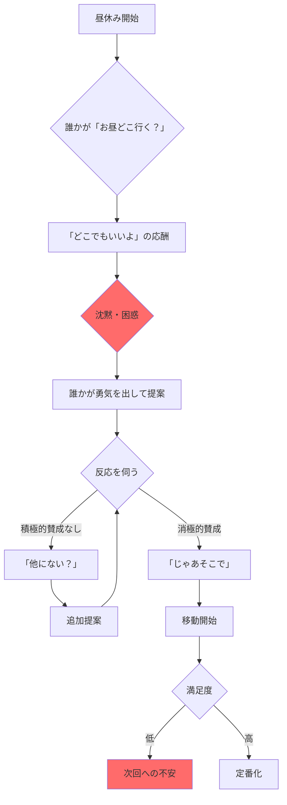
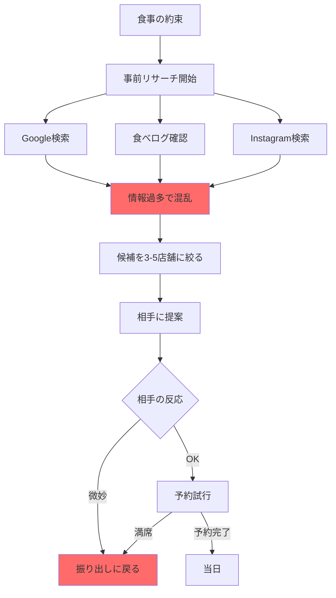
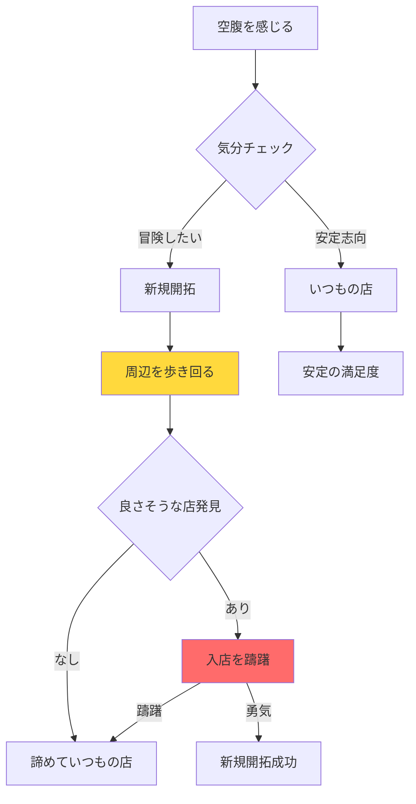
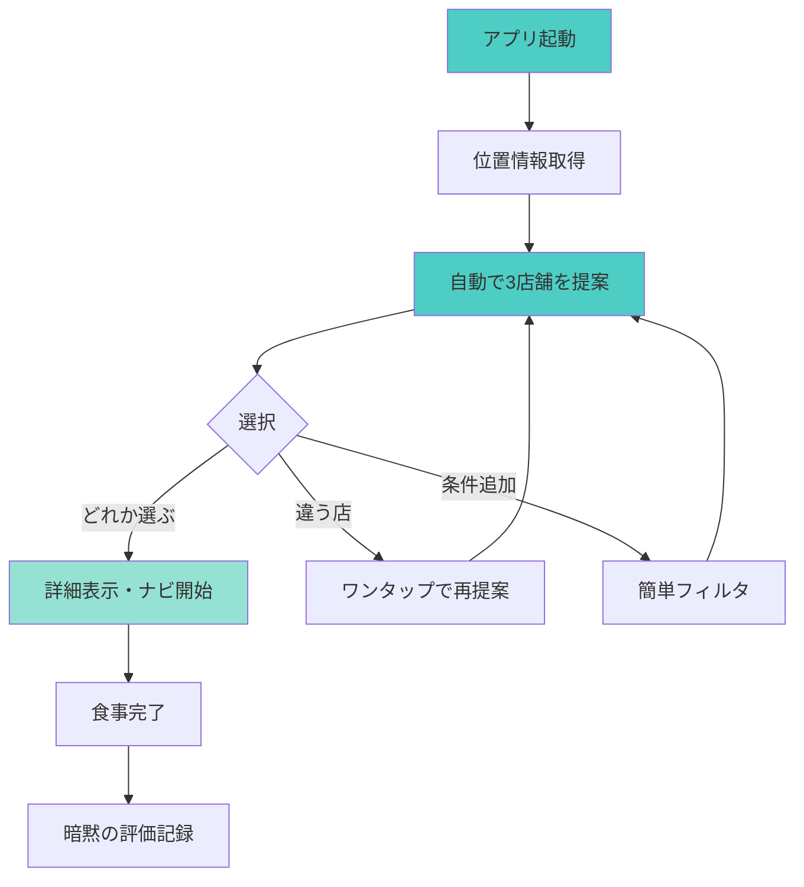

# 飲食店選択プロセス分析とUX設計

## 1. 典型的なシチュエーション別フローチャート

### シチュエーション1: 同僚とのランチ（最頻出・最重要）

**問題点**:
- 意思決定に5-10分を浪費
- 本音と建前のギャップ
- 提案者への心理的負担
- 満足度の不確実性

### シチュエーション2: デート・友人との食事

**問題点**:
- リサーチに30分以上
- 情報の信頼性が不明
- 相手の好みの推測
- 予約の手間

### シチュエーション3: 一人での食事

**問題点**:
- 新規開拓の心理的ハードル
- 情報不足による不安
- 時間のロス

## 2. 共通の課題分析

### 時間的コスト
- **意思決定時間**: 平均5-15分
- **移動時間の不確実性**: 場所が不明確
- **待ち時間リスク**: 混雑状況が不明

### 心理的コスト
- **決定責任の重さ**: 失敗したら自分のせい
- **他者への配慮**: 全員が満足するか不安
- **選択肢過多**: 情報が多すぎて決められない

### 情報コスト
- **情報の分散**: 複数サイトの確認が必要
- **信頼性の問題**: レビューの真偽不明
- **リアルタイム性**: 営業時間・混雑状況

## 3. 理想的なUXフロー設計

### コンセプト: 「決めない」という選択

### 核心的な設計思想

1. **選択肢を限定** (3つまで)
   - 選択疲れを防ぐ
   - 素早い意思決定を促す

2. **決定責任の分散**
   - 「アプリが提案した」という言い訳
   - グループ利用時の心理的安全性

3. **情報の最小化**
   - 必要最小限の情報のみ表示
   - 詳細は選択後に確認

4. **学習による最適化**
   - 使用履歴から好みを推測
   - 時間帯・曜日・天気を考慮

## 4. MVP機能要件（改訂版）

### Phase 1: コア機能

1. **即座の提案機能**
   - 起動→3秒で3店舗提案
   - 店名・ジャンル・徒歩時間のみ表示
   - ワンタップで再提案

2. **グループモード**
   - QRコード/URLで提案を共有
   - 全員が「OK」で決定
   - 匿名での意思表示

3. **最小限の詳細情報**
   - 選択後に営業時間・地図表示
   - Googleマップ連携でナビ

### Phase 2: 拡張機能

1. **暗黙の学習**
   - 選択パターンの記録
   - 滞在時間での満足度推定

2. **状況考慮**
   - 天気（雨なら近場優先）
   - 時間帯（ランチ/ディナー）
   - 曜日（平日/週末）

3. **さりげないカスタマイズ**
   - 「今日は歩きたくない」
   - 「ちょっと贅沢」
   - 「健康的に」

## 5. 成功指標（KPI）

### 定量的指標
- **決定時間**: 30秒以内
- **離脱率**: 10%以下
- **再提案回数**: 平均2回以下

### 定性的指標
- 「選ぶストレスが減った」
- 「グループランチが楽になった」
- 「新しい店を知れた」

## 6. 実装優先順位

1. **最優先**: 3店舗即時提案
2. **高**: グループ共有機能  
3. **中**: 学習機能
4. **低**: カスタマイズオプション

## 7. UI/UXガイドライン

### デザイン原則
- **シンプル**: 情報過多を避ける
- **高速**: 体感速度を最優先
- **安心感**: 失敗しても大丈夫な雰囲気

### 画面構成
1. **メイン画面**: 3枚のカード表示
2. **詳細画面**: 必要最小限の情報
3. **設定画面**: ほぼ不要（自動最適化）

---

このUX設計により、「お昼どこにする？」問題を根本的に解決し、ユーザーの意思決定コストを最小化します。